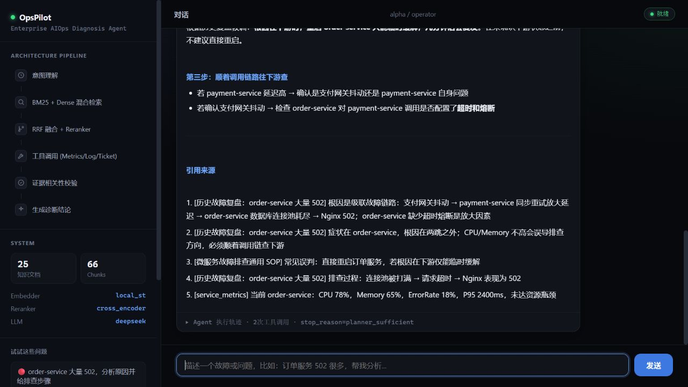
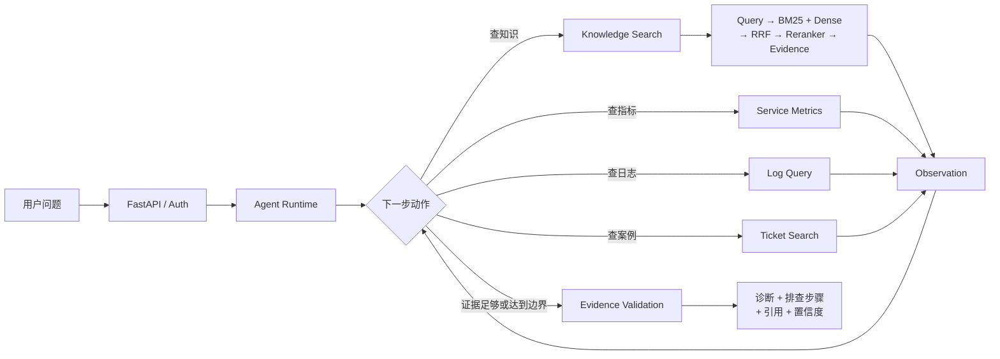

# OpsPilot — 企业智能运维诊断 Agent

> 一个能展示证据、解释检索过程、在证据不足时拒绝猜测的 AIOps 诊断 Agent。

[](https://www.python.org/)
[](https://fastapi.tiangolo.com/)
[](https://github.com/pgvector/pgvector)
[](#验证项目)
[](#真实评测结果)

OpsPilot 面向企业内部开发和运维人员。当用户输入“订单服务最近大量 502”时，它不会直接让大模型凭经验回答，而是自主选择知识库、日志、服务指标和历史工单等只读工具，收集证据后再给出诊断、排查步骤、引用和置信度。

这不是一套声称可以直接替代生产运维平台的产品，也不是把一次 LLM 调用包装成 Agent 的演示。它是一套**规模受控、核心链路完整、可运行、可评测、可调试、可审计**的工程型面试项目。



## 60 秒看懂项目

| 面试官关心的问题 | 项目中的回答 |
|---|---|
| 这真的是 Agent 吗？ | 自研有限状态循环：判断下一步、调用工具、观察结果、继续或停止；有总超时、工具预算和最大迭代次数 |
| RAG 是不是黑盒？ | 保留 BM25、Dense、RRF Fusion、Reranker、最终 Context 的候选、分数和分阶段延迟 |
| 如何减少幻觉？ | Evidence-first 生成、证据相关性校验、引用、置信度和无证据拒答 |
| 如何证明检索有效？ | 110 条结构化评测样本；计算 Recall@K、Precision@K、MRR、Hit Rate，不使用主观“感觉” |
| Tool 挂了怎么办？ | 超时、有限重试、错误 Observation、降级回答；不会无限循环或伪造工具结果 |
| 企业边界在哪里？ | 登录、RBAC、租户隔离、只读工具白名单、输入防护、限流和审计日志 |
| 规模扩大怎么办？ | MVP 使用 PostgreSQL + pgvector；只有实际向量规模、QPS 或延迟证明瓶颈后才迁移专业组件 |

## 一次诊断是怎样完成的



Agent Runtime 和 Retrieval Pipeline 是两个独立边界：Agent 决定**是否以及何时**查询知识；Knowledge Search 负责**如何**召回、融合、重排并返回证据。它们可以分别测试、替换和排障。

## 核心能力

### 1. 可控 Agent Loop

没有在第一版引入 LangGraph。项目直接实现 `decide → act → observe → decide/finalize`，完整展示 Agent 的 State、Tool Calling 和 Stop Condition：

- `max_iterations`：限制推理轮数；
- `tool_budget`：限制真实工具调用成本；
- `total_timeout`：限制整次任务耗时；
- 去重与停止条件：避免同参数重复调用；
- Tool Policy：模型只能建议动作，确定性策略层决定是否允许执行；
- Graceful Degradation：部分工具不可用时，明确说明缺失信息并基于剩余证据回答。

Tool 调用有单次硬超时、显式瞬时错误重试和指数退避；DeepSeek 对 429、5xx、网络超时最多尝试 3 次。意图识别、Planner 或答案生成最终失败时，API 返回结构化错误和人工升级建议，不把 Provider 异常直接暴露给用户。

当流程分支、持久化恢复、人工审批或长任务状态明显复杂后，再考虑迁移 LangGraph；当前规模自行维护状态更透明，也更容易解释。

### 2. 可 Debug 的 Hybrid RAG

```text
原始问题 → 可选 Query Rewrite
        ├─ BM25：擅长 502、order-service、错误码等精确词
        └─ Dense：擅长“网关连不上后端”等语义表达
                 ↓
             RRF Fusion
                 ↓
        Cross-Encoder Reranker
                 ↓
       去重 / Token Budget / Context
                 ↓
               Evidence
```

Retriever 的职责是从较大的候选集合中保持高 Recall；Reranker 使用更贵的 Query-Document 联合计算改善前排排序。因此采用“候选 Top-N → 重排 → Context Top-K”，而不是让一次向量 Top-5 同时承担召回和精排。

每次查询都会保留：原始与改写问题、BM25/Dense/Fusion/Reranker 候选、各阶段分数、过滤原因、最终上下文和分阶段延迟。它能回答“正确文档在哪一步消失”，而不只是猜测 Embedding 不好。

### 3. 面向故障诊断的只读工具

| Tool | 数据 | 用途 | 失败时行为 |
|---|---|---|---|
| `knowledge_search` | 企业技术文档与 SOP | 查原理、标准排查步骤 | 无结果时不编造，继续查实时证据或拒答 |
| `log_query` | 可复现日志 + 本机真实 Agent 日志 | 查错误模式和时间关联 | 超时后有限重试，并标记日志证据缺失 |
| `service_metrics` | 模拟企业指标 + 本机真实指标 | 查 CPU、内存、QPS、错误率、P95 | 服务不可用时降级，不把未知写成正常 |
| `ticket_search` | 历史故障工单 | 查类似事故和已验证解法 | 只作为案例证据，不自动执行历史操作 |

所有工具均为只读。用户输入“删除订单数据库”不会直接变成执行权限。

### 4. 安全与租户边界

- HMAC 签名登录令牌；未设置 `AUTH_SECRET` 时每次演示进程生成临时密钥；
- `operator / viewer / auditor` 角色与确定性工具白名单；
- alpha / beta 租户数据作用域隔离；
- Prompt Injection 基础拦截、输入长度限制和用户级滑动窗口限流；
- JSONL 审计事件记录登录、对话结果和错误；
- 不把模型输出当权限判断，不提供写数据库或执行 Shell 的 Tool。

这些能力是可测试的面试原型边界；生产环境仍应接入企业 IdP、密钥管理、数据库审计存储、细粒度资源授权和人工审批。

## 真实评测结果

以下数字来自仓库保存的实际运行结果，不是预估值。环境、模型和原始 JSON 见 [V2 验收结果](docs/v2_results.md) 与 [评测结果目录](eval/results/)。

| 指标 | 结果 | 说明 |
|---|---:|---|
| Evaluation Cases | 110 | 关键词、语义、15 条多证据、知识库外问题 |
| Recall@5 | **0.9209** | 从 0.9363 小幅下降；新增相似文档增加排序竞争 |
| Precision@5 | **0.2626** | 从 0.2418 提升 |
| MRR | **0.8754** | 从 0.8830 小幅下降 |
| 多证据 Recall | **0.7444** | 从 0.6667 提升，仍是重点优化项 |
| 冷查询平均延迟 | **1635.8 ms** | 29 文档、3 个查询的小样本基准 |
| 冷查询 P95 | **1732.9 ms** | 未观察到扩库退化，但样本不足以证明性能提升 |
| 精确查询缓存命中平均延迟 | **0.243 ms** | 仅说明缓存层开销，不代表端到端 Agent 延迟 |

真实实验还发现：当前数据集上，Cross-Encoder Reranker 并非所有指标都变好。项目保留这个负结果，并将“扩大高质量标注集、分析被降权案例”列为后续实验，而不是为了简历修改数字。

## 数据与评测集

- 29 篇原创模拟企业文档，覆盖 API、Nginx、数据库、Redis、Kubernetes、微服务、故障案例与 SOP；
- 110 条结构化评测 Case，含关键词问题、语义问题、多证据问题和知识库不存在问题；
- 每条 Case 包含 `question`、`ground_truth`、`expected_answer`、类型与难度；
- 数据质量门禁检查重复问题、无效文档引用、类别分布和必填字段；
- 检索、Answer、Agent 和系统指标分层，避免用 LLM 打分掩盖底层召回问题。

数据是为了可复现实验而构造的企业仿真数据，不含真实公司的内部资料。详见 [data](data/) 和 [eval_cases.json](eval/dataset/eval_cases.json)。

## 快速开始

### 路径 A：先看界面（无需 Docker）

要求：Python 3.11+。DeepSeek Key 不是启动必需；不配置时可以使用 mock LLM 验证完整流程。

```powershell
git clone https://github.com/Thedan-1/enterprise-aiops-agent.git
cd enterprise-aiops-agent
python -m venv .venv
.\.venv\Scripts\python -m pip install -r requirements.txt
Copy-Item .env.example .env
.\.venv\Scripts\python -m uvicorn app.offline_app:app --host 127.0.0.1 --port 8001
```

打开 `http://127.0.0.1:8001`，使用预填的演示账号登录：

```text
operator@alpha / AlphaDemo!2026
```

建议依次提问：

1. `订单服务最近大量出现 502，帮我分析原因并给出排查步骤。`
2. `查看 order-service 当前指标和最近十分钟错误日志。`
3. `火星机房的支付服务量子网关故障怎么处理？`（验证无证据拒答）

首次加载本地 Embedding/Reranker 会下载模型，启动时间取决于网络与机器性能。

### 路径 B：离线评测（无需 Docker、无需 API Key）

```powershell
.\.venv\Scripts\python eval\validate_dataset.py
.\.venv\Scripts\python scripts\run_v2_retrieval_eval.py
.\.venv\Scripts\python -m pytest tests -q
```

如需真实 DeepSeek 回答，在 `.env` 中设置：

```dotenv
LLM_PROVIDER=deepseek
DEEPSEEK_API_KEY=your_key_here
```

不要提交 `.env`。本地中文 Embedding 与 Reranker 不需要 OpenAI Key。

### 路径 C：PostgreSQL + pgvector 路径

```powershell
docker compose up -d postgres
.\.venv\Scripts\python scripts\ingest.py
.\.venv\Scripts\python eval\run_eval.py --with-agent
.\.venv\Scripts\python -m uvicorn app.main:app --reload
```

当前作者机器尚未完成该路径的端到端复验，原因是 Windows 虚拟化环境限制；代码与 Compose 配置已提供，但这项不能被描述成“已生产验证”。内存检索路径已经过完整测试。

## 验证项目

```powershell
# 73 个单元、集成、安全与边界测试
.\.venv\Scripts\python -m pytest tests -q

# 评测数据质量门禁
.\.venv\Scripts\python eval\validate_dataset.py
```

GitHub Actions 配置会运行测试和数据门禁。目前仓库工作流曾因 GitHub 账户侧 billing lock 在启动前被阻止；这是外部账户状态，不应伪装成 CI 通过。详情记录在 PR 中。

## 项目结构

```text
app/
├── agent/          # 自研 Agent 状态、Planner、Loop、Validator
├── rag/            # Chunk、Dense/BM25、Fusion、Reranker、Context
├── tools/          # 知识、日志、指标、工单只读工具
├── auth/ security/ # 登录、RBAC、租户与输入策略
├── api/ db/        # FastAPI 与 PostgreSQL 数据模型
└── static/         # 可直接使用的诊断界面
data/               # 原创企业仿真知识与工具数据
eval/               # 评测集、指标实现与真实运行结果
tests/              # 单元、集成、安全、失败路径测试
docs/               # 架构、ADR、实验、排障与面试材料
scripts/            # 数据灌入、离线演示、评测与基准脚本
```

## 已知边界（面试时应该主动说明）

- 这是单体面试原型，不是 7×24 生产 AIOps 平台；
- 企业日志和指标主要是可复现模拟数据，只有本机自身指标/日志是真实数据源；
- PostgreSQL + pgvector 路径尚待当前机器完成 Docker 复验；
- 多轮会话表已设计，但多轮上下文策略尚未完成实验；
- 端到端真实 LLM 延迟仍较高，主要来自串行 Planner/Answer 调用；
- 认证和审计适合演示安全边界，不替代企业 IdP、KMS 与集中审计平台；
- 数据规模尚不足以证明 Milvus、Kafka、Kubernetes、Multi-Agent 或 GraphRAG 的必要性，因此没有引入。

## 文档导航

| 想了解什么 | 文档 |
|---|---|
| 完整架构与数据流 | [docs/architecture.md](docs/architecture.md) |
| 技术选择与替代方案 | [docs/project_management.md](docs/project_management.md#4-adrarchitecture-decision-records) |
| 实验方法与真实结果 | [docs/experiment_results.md](docs/experiment_results.md) |
| V2 验收与剩余风险 | [docs/v2_results.md](docs/v2_results.md) |
| 故障排查手册 | [docs/project_management.md](docs/project_management.md#3-故障排查手册troubleshooting-handbook) |
| 15–30 分钟讲稿与问题库 | [docs/interview_prep.md](docs/interview_prep.md) |
| 开发状态与决策记录 | [project_management](project_management/) |
| 安全模型 | [SECURITY.md](SECURITY.md) 与 [docs/security_threat_model.md](docs/security_threat_model.md) |

## 为什么暂时不使用这些技术

| 暂不使用 | 当前理由 | 何时重新评估 |
|---|---|---|
| LangGraph | 当前循环状态可控，自研更利于理解与 Debug | 分支、暂停恢复、人工审批、持久化状态显著复杂时 |
| Redis | 单实例小数据下没有已证明的共享缓存瓶颈 | 多实例共享缓存、限流一致性或热点查询成为真实瓶颈时 |
| Milvus | pgvector 足够支撑当前规模并减少基础设施 | 百万至千万向量、并发和 P95 实测无法达标时 |
| Kafka / Flink | 没有实时大吞吐事件流需求 | 日志持续接入量和消费解耦需求被量化证明时 |
| Kubernetes | 单服务 Compose 足够，K8s 只会增加运维成本 | 多服务、多副本、滚动发布和弹性伸缩成为真实需求时 |
| Multi-Agent / GraphRAG | 当前任务没有证明需要角色协作或复杂图关系 | 单 Agent 任务成功率或普通 RAG 在明确场景达到上限时 |

## 项目状态

当前重点不是继续堆组件，而是：扩大多证据评测、定位 Reranker 负收益、优化真实 LLM 延迟、完成 pgvector 复验，并用回归测试守住已验证能力。详细计划见 [roadmap/V2_ROADMAP.md](roadmap/V2_ROADMAP.md)。

欢迎通过 Issue 提交可复现问题；贡献方式见 [CONTRIBUTING.md](CONTRIBUTING.md)。
